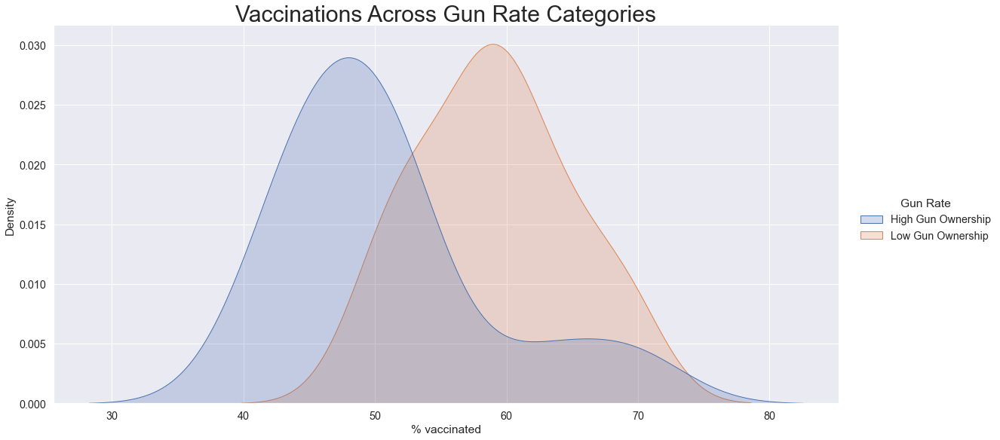
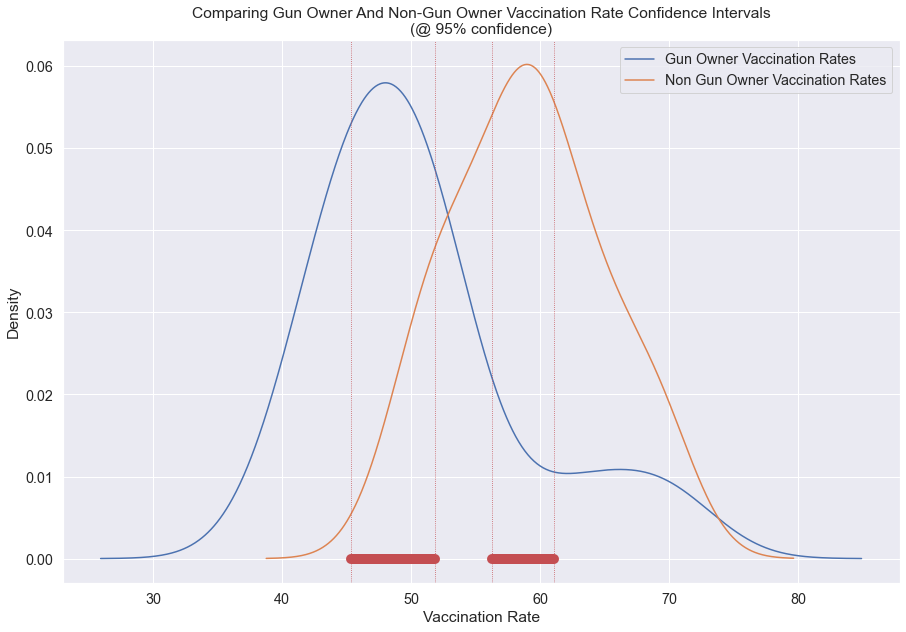
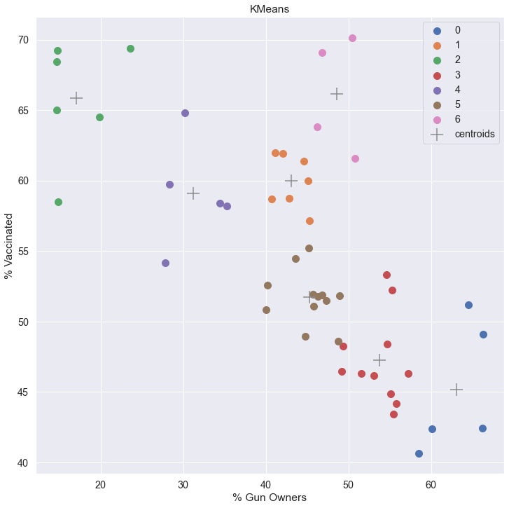

# Gun Ownership and Covid Vaccination 

#### *AKA: Guns N Needles*

For this project, I will be looking into a relationship between gun ownership and Covid vaccination rates. The rationale behind this project is that I am trying to identify a proxy characteristic to predict the likelyhood of someone deciding to get the Covid vaccine or not. Through anecdotal experiences, I found that people I knew that chose to **not** get vaccinated did so with an independent spirit, with the mindset that the individual is responsible for their own health, not the collective. Likewise, I have anecdotal experiences with people that decided to purchase a firearm with similar logic, they held that the individual is responsible for their personal safety, and that the individual should not rely on the collective approach alone. Conversely, I have found that people that chose to get vaccinated often did so from sense of duty to the community, with the mindset that it is the responsibility of the individual to contribute to the collective, not for themselves alone. Similarly, I have encountered many people that have made the decision to not own a firearm because they believe in the collective approach to providing personal safety. Remarkably, while both gun ownership and the Covid vaccine tend to be controversial and polarizing topics, I have found that people on either side of both debates seem to agree with the logic that I am putting forward to connect these issues. However, here are a few obvious exceptions to this pattern:

- some people buy guns for reasons other than personal safety (i.e. hunting or sport shooting)
- some people that believe in guns for personal safety dont have them (i.e. too expensive, blocked from legal ownership)
- some people that dont believe in getting the Covid vaccine did so anyway (i.e. employment requirement, family request)
- some people that believe in the vaccine have not gotten it (i.e. health concerns, lack of availability)

With this project **I am not attempting to convice people to change their ideas or behavior** , rather I am trying to identify a hidden belief system that seems to influence people's idea and behavioral patterns. Understanding these belief systems could be useful for facilitating better discussion about these and other issues. 

#### Data Sources
gun ownership rates data available [here](https://worldpopulationreview.com/state-rankings/gun-ownership-by-state) downloadable as a csv or json file

state vaccination rates data available [here](https://github.com/owid/covid-19-data/tree/master/public/data/vaccinations) as a csv file called "us_state_vaccinations.csv"

### Initial plot with regression line

Above we see a clear linear relationship pattern, with a few outlier exceptions.

### Comparing distributions

Using the median gun ownership value to define "Gun Owner" and "Non-Gun Owner" states, we see a clear difference in the vaccination rate distributions, and means, between the two groups. This difference was shown to be statistically significant by T testing the group mean differences. 

### Confidence Intervals

Confidence intevals show the difference in estimated population mean vaccination rates between gun owners and non-gun owners. 

### Cluster analysis

While difficult to read, this chart shows how the outlying states sit outside the linear relationship in a couple of groups. This cluster analysis doesnt show much, other than that there appears to be a small handfull of states that dont seem to match my model. Some next steps that I thought would be interesting would be to see if there were any geographic, demographic, or other similarities between these states that sets them apart. Perhaps that analysis could even uncover a trend that could form an even better model than the one proposed here. 

## Conclusion:
While using gun ownership as a proxy for an ideology that helps predict an individual's likelihood to get vaccinated for Covid-19 is interesting and does carry some merrit, this idea comes with great difficulty in obtaining significant data at the individual level and carries too much political baggage to be worth much more pursuit. 

## See the full project [here](https://github.com/nathaniel-j/Guns_n_Needles/blob/main/Guns_N_Needles_update.ipynb)
